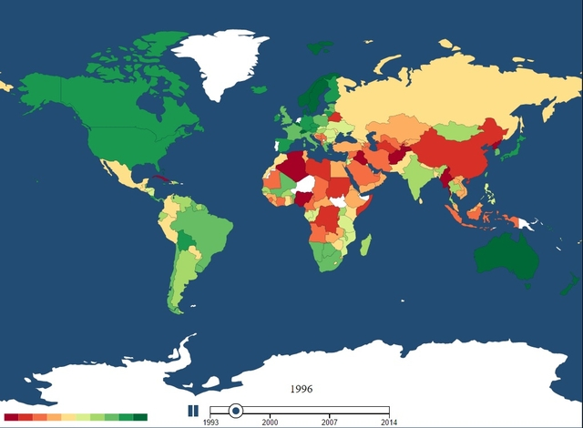
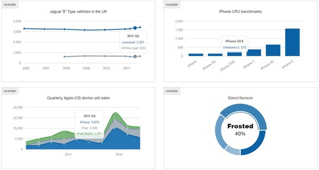
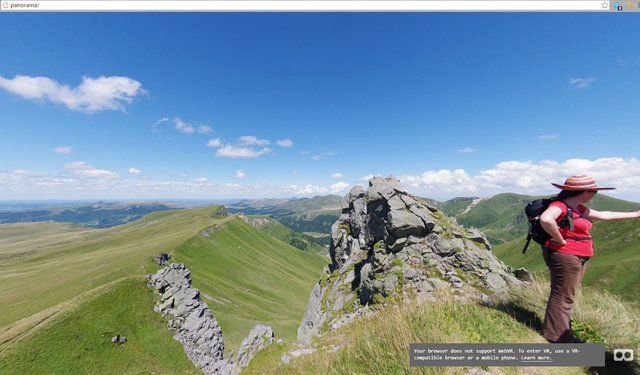
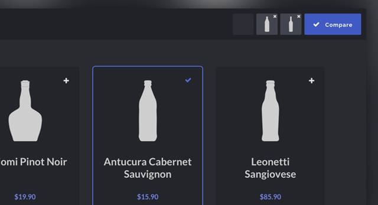
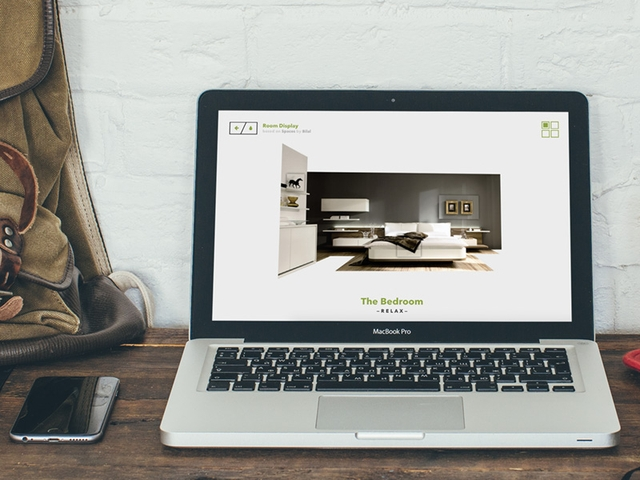
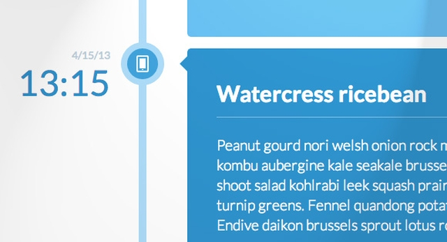
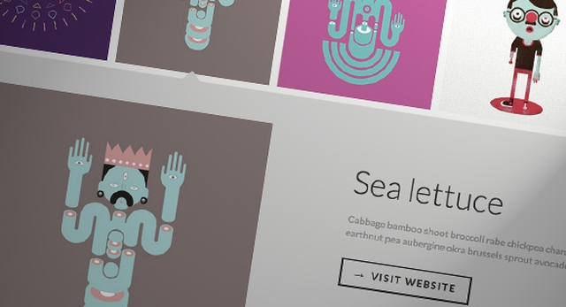

# Содержание:

 

- [**D3.js - визуализация карты**](./d3js-map-visualization.zip)

 
---
 

- [**Morris.js - графики**](http://morrisjs.github.io/morris.js/)

 
---
 

- [**Панорама**](./panorama.zip)

*Стройтельство блоков виртуальной реальности в вэб. работает на ПК, iOS, Android, очках виртуальной реальности Oculus Rift.* [Ссылка на проект](https://aframe.io/)

 
---
 

- [**Сравнение продуктов**](./product-comparison.zip)

 
---
 

- [**Интерективные интерьер**](./room-display.zip)

 
---
 

- [**Вертикальная временная шкала**](./vertical-timeline.zip)

 
---
 

- [**Миниатюрная сетка с расширенным просмотром**](./thumbnail-grid-expanding-preview.zip)

 
---
 

#### [Перейти в начало](https://github.com/tsvetkovpro/sources)
